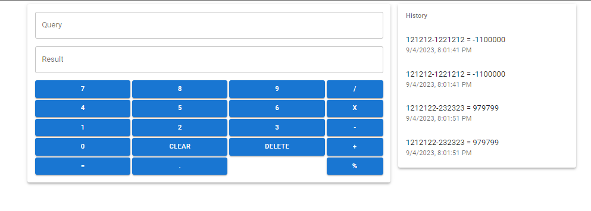
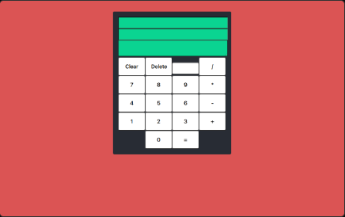

<h2 align="left">Simple Calculator </h2> 

Link: https://simple-calculator-react.vercel.app/

 
Calculator built using React & Typescript that keeps track of previous calculations for user to review.

- Mobile Compatible
- Supports keyboard input
- Supports button click
- Keeps an organized history of calculations

## Latest Version

## Old Version

### Issues with old version
- Built on outdated react version
- Buttons were not well aligned
- Lacked mobile compatibility
- No difference between query, result and history screens

## 🏁 Getting Started   
- Simply clone the repository, run `npm install` and then run `npm start`. You should be able to access the project locally on `http://localhost:3000`
- You could also access it here: https://simple-calculator-react.vercel.app/

## ⛏️ Built Using   
- React (Typescript)
- Material-UI
  
## 👏 Acknowledgements     
- I found all the images from online sources and credit goes to their respective owners
  
## 📝 License   
- MIT

